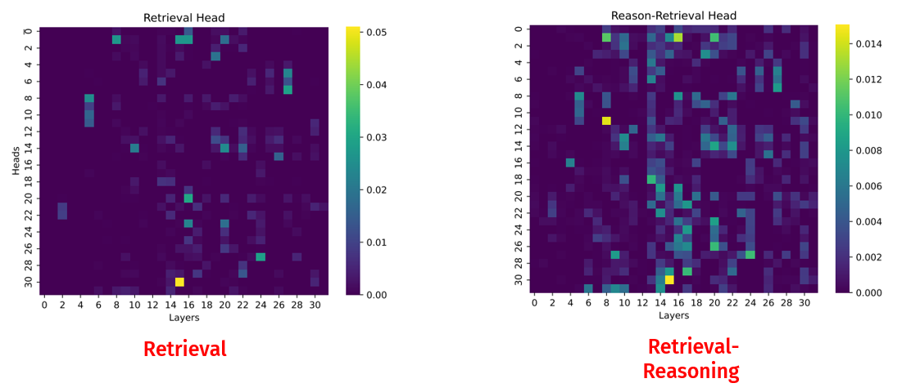

# Retrieval_Reasoning_Head


## 1. Install Packages
```python
conda env create -f head.yml
```


## 2. Head Detection
### 2.1 Obtain Retrieval heads
references: [Retrieval Heads](https://github.com/nightdessert/Retrieval_Head/tree/main)

```python
python retrieval_head_detection.py  \
    --model_path meta-llama/Meta-Llama-3-8B-Instruct \
    --model_provider LLAMA3 \
    --s 0 \
    --e 10000 \
```
By default, it will use datasets from `haystack_for_detect` and write score to `./head_score/${model_name}_retrieval_heads.json`.

## 2.2 Obtain Retrieval-Reasoning heads

```python
python retrieval_head_detection_r2.py  \
    --model_path meta-llama/Meta-Llama-3-8B-Instruct \
    --model_provider LLAMA3 \
    --s 0 \
    --e 10000 \
    --task retrieval_reasoning_heads \
    --haystack_dir ./haystack_for_detect_r2
```

## 3. Visualization
 Visualization results on Llama3.



## Citation
```python
@misc{fu2024headsmatterheadlevelkv,
      title={Not All Heads Matter: A Head-Level KV Cache Compression Method with Integrated Retrieval and Reasoning}, 
      author={Yu Fu and Zefan Cai and Abedelkadir Asi and Wayne Xiong and Yue Dong and Wen Xiao},
      year={2024},
      eprint={2410.19258},
      archivePrefix={arXiv},
      primaryClass={cs.CL},
      url={https://arxiv.org/abs/2410.19258}, 
}
```

## Acknowledgement
Thanks [Retrieval Heads](https://github.com/nightdessert/Retrieval_Head/tree/main) for providing open-source code and data.